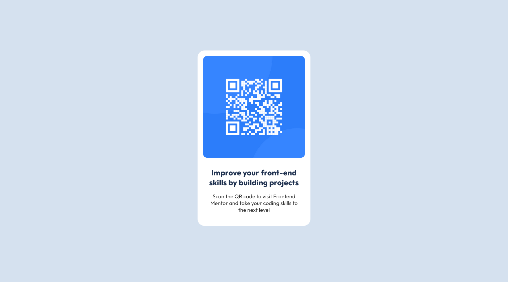

# Frontend Mentor - QR code component solution

This is a solution to the [QR code component challenge on Frontend Mentor](https://www.frontendmentor.io/challenges/qr-code-component-iux_sIO_H). Frontend Mentor challenges help you improve your coding skills by building realistic projects. 

## Table of contents

- [Overview](#overview)
  - [Screenshot](#screenshot)
  - [Links](#links)
- [Author](#author)

## Overview

### Screenshot

#### Desktop
---

#### Mobile
---

### Links

- Solution URL: [solution URL here](https://github.com/HaoZhenSiow/QR-code-component-challenge-hub.git)
- Live Site URL: [live site URL here](https://haozhensiow.github.io/QR-code-component-challenge-hub)

## Author

- Website - [Siow Hao Zhen](https://github.com/HaoZhenSiow)
- Frontend Mentor - [@HaoZhenSiow](https://www.frontendmentor.io/profile/HaoZhenSiow)